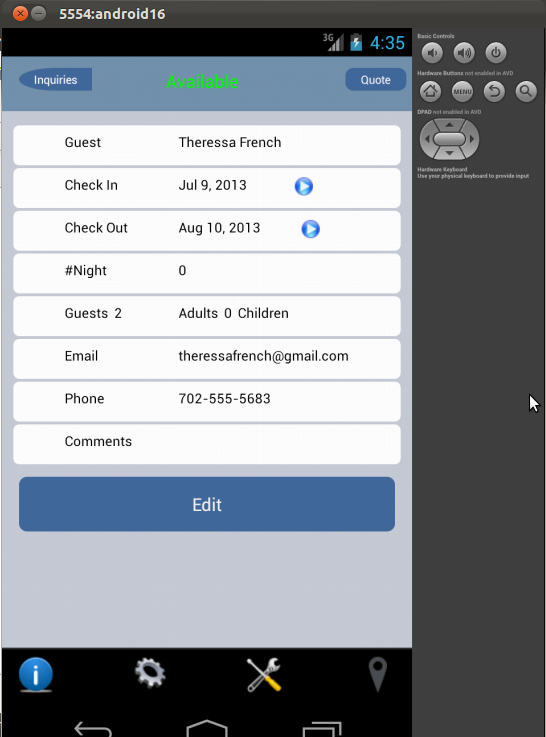
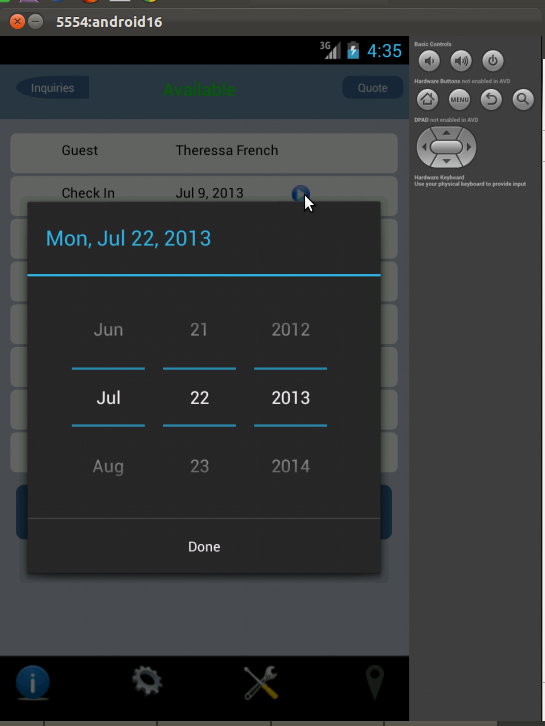

<h1> Date Picker Example In Ruboto </h1>
<ul> Here I used the following widgets 
	<li> TableLayout </li>
	<li> Action Bar </li>
	<li> TextView </li>
	<li> Button </li>
	<li> RelativeLayout </li>
	<li> ImageButton </li>
</ul>

 In this example I created a TableLayout with some details for check in and check out rows i added a image button with an event 

	  

 when we click on the button the DatePickerDialog will open 

	  

 After we select the date the selected date will be displyed here like this 

	  

<h3> Use it </h3>

<h2> Thank you </h2>
